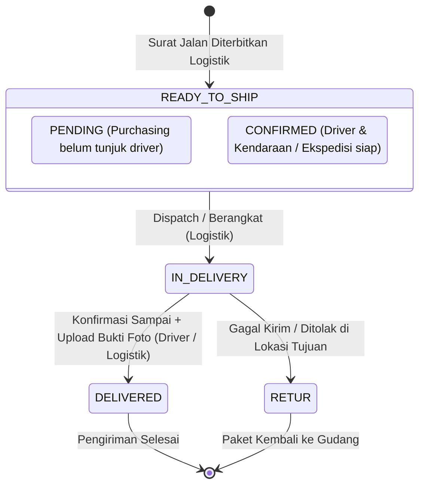

# 📘 Panduan Integrasi API: Monitoring Progres Pengiriman & Status Shipping (Sistem A)

Dokumen ini berisi spesifikasi teknis, kamus data, dan instruksi bagi pengembang **Sistem A (Sistem Eksternal / PPIC / Client Portal / ERP)** untuk menarik (*pull/fetch*) progres pengiriman (*shipping tracking*), status surat jalan, penugasan armada/driver, serta bukti foto serah terima barang (*Proof of Delivery*) dari **JLU Inventory System**.

---

## 🌐 Base URL & Autentikasi

* **Base URL**: `http://localhost:3000/api` *(sesuaikan dengan domain server produksi, contoh: `https://inventory.jasalaksamautama.com/api`)*
* **Format Data**: JSON (`application/json`)
* **Header Default**:
  ```http
  Content-Type: application/json
  Cookie: auth_token=<JWT_TOKEN_VALID>
  ```

> [!NOTE]
> Jika Sistem A belum memiliki token, Sistem A dapat melakukan autentikasi awal melalui endpoint `POST /api/auth/login` menggunakan kredensial akun service (role: `ADMIN`, `SUPERADMIN`, atau `USER`) untuk memperoleh Cookie `auth_token`.

---

## 1. 🔄 Siklus Hidup Status Pengiriman (Shipping State Flow)

Berikut adalah siklus perubahan status dari satu manifes pengiriman (Surat Jalan):



### Penjelasan Status Utama:
| Status | Label UI | Deskripsi | Ketersediaan Bukti Foto |
| :--- | :--- | :--- | :--- |
| `READY_TO_SHIP` | **Siap Kirim** | Surat Jalan telah dibuat. Sedang menunggu penunjukan armada oleh Purchasing atau siap diberangkatkan. | Belum ada |
| `IN_DELIVERY` | **Dalam Perjalanan** | Armada telah berangkat membawa muatan menuju lokasi tujuan proyek. | Opsional (Foto keberangkatan) |
| `DELIVERED` | **Sudah Sampai** | Barang telah tiba di lokasi dan diterima oleh PIC lapangan. Bukti foto serah terima telah diunggah. | **Wajib / Tersedia** (`deliveryProofUrl`) |
| `RETUR` | **Retur / Gagal** | Pengiriman dibatalkan / ditolak di lokasi proyek karena kendala lapangan. | - |

---

## 2. 📥 Endpoint 1: Tarik Daftar Pengiriman (`GET /api/shipping`)

Endpoint ini digunakan oleh Sistem A untuk menarik seluruh daftar pengiriman atau memfilter pengiriman yang sedang berjalan (*tracking active shipments*).

### 🔹 Spesifikasi Endpoint:
```http
GET /api/shipping
```

### 🔹 Query Parameters:
| Parameter | Tipe | Wajib | Keterangan |
| :--- | :--- | :--- | :--- |
| `status` | String | Tidak | Filter berdasarkan status (`READY_TO_SHIP`, `IN_DELIVERY`, `DELIVERED`, `RETUR`). Jika dikosongkan, mengambil semua status. |
| `projectId` | String (UUID) | Tidak | Filter pengiriman berdasarkan ID proyek spesifik di JLU Inventory. |

---

### 🔹 Contoh Request (cURL):
```bash
curl -X GET "http://localhost:3000/api/shipping?status=IN_DELIVERY" \
  -H "Cookie: auth_token=eyJhbGciOiJIUzI1NiIsInR5cCI6IkpXVCJ9..."
```

---

### 🔹 Contoh Respon JSON (200 OK):
```json
{
  "shipments": [
    {
      "id": "cfe0cb10-83b3-4cf4-bc5e-82fbb87a730d",
      "suratJalanNo": "SJ-20260908-6221",
      "projectId": "cca77baf-f480-4b5c-b0ae-e03229142935",
      "deliveryDate": "2026-09-08T00:00:00.000Z",
      "shippingMethod": "INTERNAL_DELIVERY",
      "destination": "Kalimantan Timur, Site KARHUTLA",
      "estimatedWeight": 140.5,
      "estimatedDimension": "1200x800x600",
      "notes": "Armada berangkat pukul 08:30 via Tol Trans-Jawa",
      "status": "DELIVERED",
      "fleetRequestStatus": "CONFIRMED",
      "driverId": "38da37bb-99bb-494b-a75d-357199c0175b",
      "vehicleId": "f7ab2ca8-d6e6-42d7-a50d-bc16e87c0e81",
      "expeditionName": null,
      "driverName": "Pak Budi Santoso",
      "driverPhone": "081234567890",
      "vehiclePlateNumber": "B 9182 JLU",
      "createdByName": "Dimas (Staff Logistik)",
      "deliveryProofUrl": "https://xyz.supabase.co/storage/v1/object/public/bukti_pengiriman/proofs/1788851234-serah_terima_site.jpg",
      "receivedByName": "Bpk. Joko (Mandor / PIC Site KARHUTLA)",
      "deliveredAt": "2026-09-08T14:40:00.000Z",
      "approvalLogistics": true,
      "approvalPurchasing": true,
      "approvalManagement": false,
      "createdAt": "2026-09-08T07:15:00.000Z",
      "updatedAt": "2026-09-08T14:40:15.000Z",
      "driver": {
        "id": "38da37bb-99bb-494b-a75d-357199c0175b",
        "name": "Pak Budi Santoso",
        "phone": "081234567890",
        "licenseNumber": "SIM-B2-99182"
      },
      "vehicle": {
        "id": "f7ab2ca8-d6e6-42d7-a50d-bc16e87c0e81",
        "name": "Isuzu Giga Wingbox",
        "plateNumber": "B 9182 JLU",
        "type": "TRUCK_BOX"
      },
      "project": {
        "id": "cca77baf-f480-4b5c-b0ae-e03229142935",
        "projectName": "Conveyor Belt 150 Meter",
        "projectNumber": "PRJ-2026-0089",
        "customer": {
          "id": "58c89b33-e009-43c2-a9b0-9db02e703901",
          "name": "Bpk. Hendra",
          "company": "PT. Surya Logistik Makmur",
          "phone": "081198765432",
          "address": "Jl. Industri Raya Blok C, Balikpapan"
        }
      },
      "packages": [
        {
          "id": "70d10c0e-e5d8-4f11-97b0-c0abf105bb99",
          "code": "PKG-20260908-0001",
          "lotNo": "1",
          "packageType": "PALET",
          "itemName": "[{\"itemName\":\"ROLLER CONVEYOR SECTION A\",\"qty\":2,\"unit\":\"UNIT\"}]",
          "qty": 2,
          "unit": "UNIT",
          "weight": 140.5,
          "dimensions": "1200x800x600",
          "status": "DELIVERED",
          "ppicStatus": "APPROVED"
        }
      ]
    }
  ]
}
```

---

## 3. 🔍 Endpoint 2: Tarik Detail Satu Pengiriman (`GET /api/shipping/[id]`)

Jika Sistem A ingin memantau update status per Surat Jalan secara spesifik berdasarkan UUID pengiriman.

### 🔹 Spesifikasi Endpoint:
```http
GET /api/shipping/{id}
```

### 🔹 Path Parameters:
| Parameter | Tipe | Keterangan |
| :--- | :--- | :--- |
| `id` | String (UUID) | ID unik pengiriman (`shipment.id`) |

### 🔹 Contoh Respon JSON (200 OK):
```json
{
  "shipment": {
    "id": "cfe0cb10-83b3-4cf4-bc5e-82fbb87a730d",
    "suratJalanNo": "SJ-20260908-6221",
    "status": "DELIVERED",
    "deliveryProofUrl": "https://xyz.supabase.co/storage/v1/object/public/bukti_pengiriman/proofs/1788851234-serah_terima_site.jpg",
    "receivedByName": "Bpk. Joko (Mandor / PIC Site KARHUTLA)",
    "deliveredAt": "2026-09-08T14:40:00.000Z",
    "destination": "Kalimantan Timur, Site KARHUTLA",
    "shippingMethod": "INTERNAL_DELIVERY",
    "driverName": "Pak Budi Santoso",
    "driverPhone": "081234567890",
    "vehiclePlateNumber": "B 9182 JLU",
    "packages": [ ... ]
  }
}
```

---

## 4. 📖 Kamus Data (Data Dictionary)

Berikut adalah panduan membaca setiap field status agar Sistem A dapat memetakan ke database atau dashboard Sistem A:

| Field | Tipe | Contoh Nilai | Penjelasan untuk Sistem A |
| :--- | :--- | :--- | :--- |
| `status` | String | `'IN_DELIVERY'` / `'DELIVERED'` | **Status Progres Utama**. Gunakan field ini untuk indikator progres bar di Sistem A. |
| `deliveryProofUrl` | String (URL) | `'https://.../foto.jpg'` | **URL Foto Bukti Penerimaan**. Akan berisi tautan langsung gambar saat barang telah diterima di lokasi. |
| `receivedByName` | String | `'Bpk. Joko (PIC Site)'` | **Nama Pihak Penerima**. Diinput saat serah terima barang di lapangan. |
| `deliveredAt` | Timestamp (ISO8601) | `'2026-09-08T14:40:00.000Z'` | **Waktu Tiba**. Waktu riil saat status diubah menjadi `DELIVERED`. |
| `shippingMethod` | String | `'INTERNAL_DELIVERY'` / `'EKSPEDISI'` / `'CUSTOMER_PICKUP'` | Metode logistik: Armada JLU sendiri, Ekspedisi Luar (pihak ke-3), atau Customer ambil sendiri. |
| `fleetRequestStatus` | String | `'CONFIRMED'` / `'PENDING'` | Status penugasan armada oleh Purchasing. Jika `CONFIRMED`, driver dan kendaraan sudah ditugaskan. |
| `expeditionName` | String | `'Dakota Cargo' / 'JNE Trucking'` | Nama vendor ekspedisi (hanya terisi jika `shippingMethod == 'EKSPEDISI'`). |
| `driverName` | String | `'Pak Budi Santoso'` | Nama driver yang membawa muatan. |
| `driverPhone` | String | `'081234567890'` | Nomor kontak driver (dapat digunakan untuk integrasi WA otomatis di Sistem A). |
| `vehiclePlateNumber`| String | `'B 9182 JLU'` | Nomor plat polisi armada pengangkut. |
| `createdByName` | String | `'Dimas (Staff Logistik)'` | Akun pembuat Surat Jalan yang menandatangani secara digital. |
| `notes` | String | `'Armada via tol...'` | Catatan perjalanan atau kondisi serah terima barang. |
| `packages[].status` | String | `'SHIPPED'` / `'DELIVERED'` | Status item paket koli di dalam surat jalan terkait. |

---

## 5. 💻 Contoh Implementasi Kode untuk Sistem A

### 🔹 Contoh 1: Node.js / TypeScript (Polling Script)
```typescript
import axios from 'axios';

interface ShippingProgress {
  id: string;
  suratJalanNo: string;
  status: 'READY_TO_SHIP' | 'IN_DELIVERY' | 'DELIVERED' | 'RETUR';
  driverName?: string;
  vehiclePlateNumber?: string;
  deliveryProofUrl?: string;
  receivedByName?: string;
  deliveredAt?: string;
}

const JLU_API_BASE = 'http://localhost:3000/api';
const AUTH_COOKIE = 'auth_token=YOUR_VALID_JWT_TOKEN_HERE';

export async function fetchActiveShippingProgress(): Promise<ShippingProgress[]> {
  try {
    // Tarik pengiriman yang sedang jalan (IN_DELIVERY) dan yang baru sampai (DELIVERED)
    const response = await axios.get(`${JLU_API_BASE}/shipping`, {
      headers: {
        'Cookie': AUTH_COOKIE,
      },
      params: {
        // filter jika diperlukan
      }
    });

    const shipments: ShippingProgress[] = response.data.shipments;
    
    shipments.forEach(s => {
      console.log(`[Surat Jalan ${s.suratJalanNo}] Status: ${s.status}`);
      if (s.status === 'DELIVERED') {
        console.log(` -> Telah diterima oleh: ${s.receivedByName}`);
        console.log(` -> Bukti Foto: ${s.deliveryProofUrl}`);
        console.log(` -> Waktu Tiba: ${s.deliveredAt}`);
      } else if (s.status === 'IN_DELIVERY') {
        console.log(` -> Sedang di jalan bersama Driver: ${s.driverName} (${s.vehiclePlateNumber})`);
      }
    });

    return shipments;
  } catch (error: any) {
    console.error('Gagal menarik status pengiriman dari JLU Inventory:', error.response?.data || error.message);
    throw error;
  }
}
```

---

### 🔹 Contoh 2: Python (Requests)
```python
import requests

JLU_BASE_URL = "http://localhost:3000/api"
COOKIES = {
    "auth_token": "YOUR_VALID_JWT_TOKEN_HERE"
}

def get_shipping_progress():
    url = f"{JLU_BASE_URL}/shipping"
    params = {
        "status": "DELIVERED"  # Mengambil hanya yang sudah sampai
    }
    
    response = requests.get(url, cookies=COOKIES, params=params)
    
    if response.status_code == 200:
        data = response.json()
        for item in data.get("shipments", []):
            print(f"Surat Jalan: {item.get('suratJalanNo')}")
            print(f"Status      : {item.get('status')}")
            print(f"Penerima    : {item.get('receivedByName')}")
            print(f"Bukti Foto  : {item.get('deliveryProofUrl')}")
            print(f"Tiba Pada   : {item.get('deliveredAt')}")
            print("-" * 40)
    else:
        print(f"Error {response.status_code}: {response.text}")

if __name__ == "__main__":
    get_shipping_progress()
```

---

## 6. ⏱️ Rekomendasi Interval Polling & Webhook

1. **Frekuensi Polling yang Direkomendasikan**:
   - Untuk memantau pengiriman aktif (`status=IN_DELIVERY`), jalankan cron job / polling di Sistem A setiap **2 hingga 5 menit**.
2. **Kondisi Selesai (Termination Condition)**:
   - Jika `status == "DELIVERED"` dan `deliveryProofUrl != null`, Sistem A dapat mengunci record di Sistem A sebagai **"PENGIRIMAN SUKSES / SELESAI"** dan tidak perlu melakukan polling ulang untuk ID Surat Jalan tersebut.
3. **Penyimpanan Gambar**:
   - URL `deliveryProofUrl` merupakan tautan langsung (*Public / Signed URL*) ke Supabase Storage JLU yang dapat langsung ditampilkan di antarmuka web/mobile Sistem A tanpa perlu autentikasi tambahan untuk melihat gambarnya.

---

## 7. 🛡️ Kode Respon HTTP (Error Handling)

| Kode Status | Arti | Penyebab & Solusi |
| :--- | :--- | :--- |
| `200 OK` | Berhasil | Data pengiriman sukses ditarik. |
| `401 Unauthorized` | Autentikasi Gagal | Cookie `auth_token` kosong, kadaluarsa, atau tidak valid. Lakukan login ulang via `POST /api/auth/login`. |
| `403 Forbidden` | Akses Ditolak | Akun yang digunakan tidak memiliki role yang diizinkan untuk melihat pengiriman. |
| `404 Not Found` | Data Tidak Ditemukan | ID pengiriman tidak ditemukan di database. |
| `500 Server Error` | Gangguan Server | Terjadi kesalahan database internal. Hubungi tim teknis JLU. |
