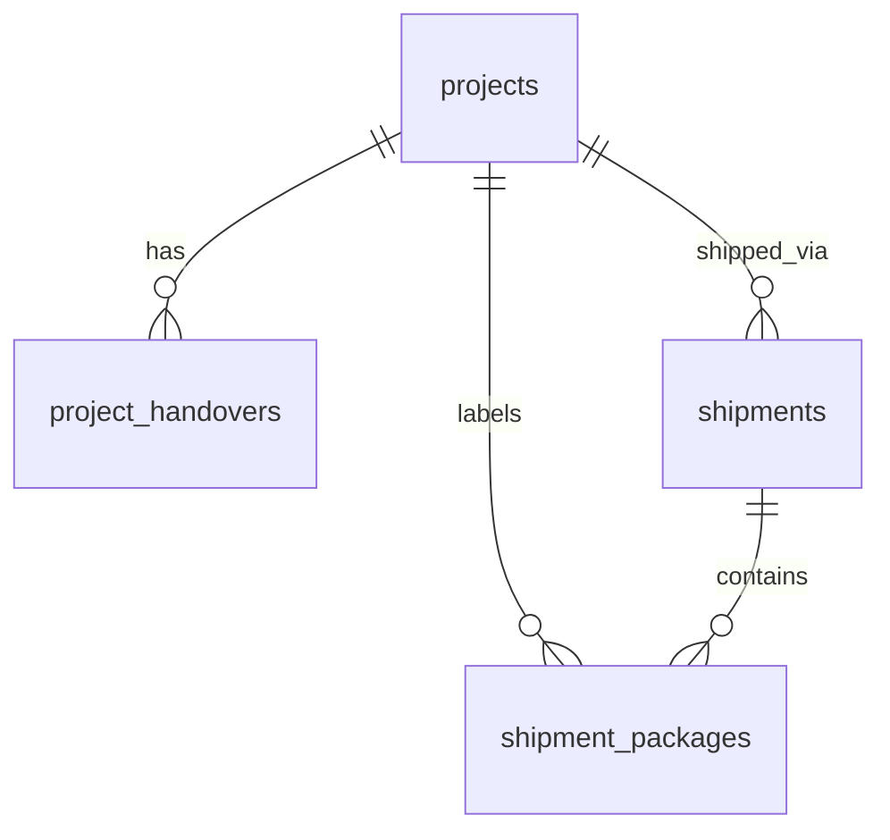

# Panduan Pengambilan Status Pengiriman (Shipping Status Integration Guide)

Dokumen ini ditujukan untuk tim pengembang sistem eksternal (**Sistem A** / Sistem Integrator) sebagai referensi teknis untuk mengambil (fetch/pull) dan memantau status pengiriman barang (**Shipping & Marking**) dari database JLU Inventory Tracker secara akurat.

---

## 1. Alur Pengambilan Data (Integration Methods)

Ada dua metode utama yang dapat digunakan oleh Sistem A untuk mengambil status pengiriman:
1. **REST API (HTTP GET)**: Metode yang direkomendasikan jika integrasi menggunakan protokol web standar.
2. **Kueri Langsung Database (Direct SQL)**: Metode yang digunakan jika Sistem A memiliki akses langsung ke database PostgreSQL JLU Inventory.

---

## 2. Struktur Endpoint REST API

Semua endpoint API di bawah ini menggunakan method **`GET`** dan mengembalikan respon berformat **JSON**.

### A. Mendapatkan Daftar Pengiriman (`GET /api/shipping`)
Mengambil semua data Surat Jalan / Manifes pengiriman aktif.
* **Query Parameters (Pilihan/Filter)**:
  * `status`: Menyaring berdasarkan status pengiriman (`READY_TO_SHIP`, `IN_DELIVERY`, `DELIVERED`, `RETUR`).
  * `projectId`: Menyaring Surat Jalan berdasarkan ID proyek tertentu.
* **Contoh URL**: `/api/shipping?status=IN_DELIVERY`
* **Contoh Struktur Respon JSON**:
  ```json
  {
    "shipments": [
      {
        "id": "7b0931db-9d8a-4d7a-8fef-3c97ea15d18d",
        "suratJalanNo": "SJ-20260619-8422",
        "deliveryDate": "2026-06-19T00:00:00.000Z",
        "shippingMethod": "INTERNAL_DELIVERY",
        "destination": "Workshop PT. Jaya Sentosa, Tangerang",
        "status": "IN_DELIVERY",
        "project": {
          "id": "a21d0343-cd57-4354-8c5e-d06141d29b4c",
          "projectName": "Conveyor Belt 200 Meter",
          "projectNumber": "PROJECT-06-2026-002"
        },
        "driver": {
          "id": "d3b07384-d113-43b3-8b77-cfb5239a584a",
          "name": "Ahmad Supriyadi"
        },
        "vehicle": {
          "id": "v7b1029c-a112-4229-881b-a91219b139cc",
          "name": "Truk Colt Diesel Engkel",
          "plateNumber": "B 9876 CDE"
        },
        "packages": [
          {
            "id": "pkg-1122-3344",
            "code": "MRK-JLU-20260619-001",
            "itemName": "Frame Conveyor Section A",
            "qty": 1,
            "unit": "Unit",
            "weight": 120,
            "status": "SHIPPED"
          }
        ]
      }
    ]
  }
  ```

### B. Mendapatkan Detail Satu Pengiriman (`GET /api/shipping/[id]`)
Mengambil detail lengkap satu Surat Jalan berdasarkan ID pengiriman.
* **Contoh URL**: `/api/shipping/7b0931db-9d8a-4d7a-8fef-3c97ea15d18d`

### C. Mendapatkan Daftar Paket / Marking (`GET /api/shipping/packages`)
Mengambil semua paket stiker logistik (label marking) yang terdaftar.
* **Query Parameters (Pilihan/Filter)**:
  * `status`: Status paket (`READY_TO_SHIP` atau `SHIPPED`).
  * `projectId`: ID Proyek asal paket.
  * `shipmentId`: Gunakan nilai `"null"` untuk menyaring paket/label yang **belum dijadwalkan** masuk ke Surat Jalan.
* **Contoh URL**: `/api/shipping/packages?shipmentId=null`

### D. Mendapatkan Jumlah Badge Antrean (`GET /api/notifications/counts`)
Mengambil ringkasan jumlah antrean pengiriman logistik saat ini secara real-time.
* **Properti Relevan**:
  * `pendingHandovers`: Jumlah serah terima QC yang statusnya belum di-accept (`logStatus !== 'ACCEPTED'`).
  * `shippingReady`: Jumlah manifes pengiriman dengan status `READY_TO_SHIP`.
  * `shippingTransit`: Jumlah manifes pengiriman yang sedang di perjalanan (`IN_DELIVERY`).

---

## 3. Struktur Tabel Database & Skema Hubungan

Sistem A dapat memonitor status pengiriman secara langsung melalui PostgreSQL dengan membaca tabel-tabel berikut:



### A. Tabel `projects` (Status Utama Proyek)
Menyimpan status logistik dan QC pada level proyek.
* **`logStatus`** (`VARCHAR`):
  * `"PENDING"`: Baru diserahterimakan dari QC, menunggu logistik menerima & memproses.
  * `"ACCEPTED"`: Sudah diterima oleh Logistik dan siap diproses marking stiker kemasan.
* **`qcStatus`** (`VARCHAR`):
  * `"PENDING"`: Menunggu pengecekan/inspeksi berkas Packing List oleh QC.
  * `"APPROVED"`: Sudah disetujui QC (Syarat wajib untuk membuat Surat Jalan).
  * `"REJECTED"`: Ditolak oleh QC.

### B. Tabel `shipments` (Surat Jalan Pengiriman)
Menyimpan manifes utama Surat Jalan.
* **`status`** (`VARCHAR`):
  * **`"READY_TO_SHIP"`**: Surat Jalan telah dibuat. Pengiriman internal menunggu penugasan driver & armada.
  * **`"IN_DELIVERY"`**: Pengiriman sedang berjalan (armada berangkat/dispatch).
  * **`"DELIVERED"`**: Pengiriman selesai diterima dengan sukses di tujuan.
  * **`"RETUR"`**: Pengiriman gagal / barang dikembalikan ke workshop.
* **`fleetRequestStatus`** (`VARCHAR`):
  * `"PENDING"`: Pengiriman internal menunggu penunjukan driver & plat nomor oleh Purchasing.
  * `"CONFIRMED"`: Driver & kendaraan sudah ditunjuk.
  * `"NOT_REQUESTED"`: Untuk metode pengambilan mandiri (`CUSTOMER_PICKUP`).

### C. Tabel `shipment_packages` (Paket / Label Marking)
Menyimpan baris data barang/koli yang ditempel stiker logistik.
* **`status`** (`VARCHAR`):
  * **`"READY_TO_SHIP"`**: Label sudah dibuat, siap dimasukkan ke Surat Jalan.
  * **`"SHIPPED"`**: Paket sudah berangkat (terkait ke Surat Jalan berstatus `IN_DELIVERY` atau `DELIVERED`).
* **`shipmentId`** (`UUID`, Nullable): ID Surat Jalan terkait. Jika `NULL`, berarti paket belum dijadwalkan kirim.

---

## 4. Contoh Query SQL PostgreSQL (Untuk Sistem A)

### A. Mengambil Status Pengiriman Aktif Berdasarkan Nomor Surat Jalan
```sql
SELECT 
    s."suratJalanNo" AS "No Surat Jalan",
    p."projectNumber" AS "No Projek",
    p."projectName" AS "Nama Projek",
    s."status" AS "Status Pengiriman",
    s."destination" AS "Alamat Tujuan",
    s."deliveryDate" AS "Tanggal Rencana Kirim",
    d."name" AS "Nama Driver",
    v."plateNumber" AS "Plat Kendaraan"
FROM shipments s
JOIN projects p ON s."projectId" = p.id
LEFT JOIN drivers d ON s."driverId" = d.id
LEFT JOIN vehicles v ON s."vehicleId" = v.id
WHERE s."suratJalanNo" = 'SJ-20260619-8422';
```

### B. Mengambil Daftar Paket yang Dibawa di dalam Surat Jalan Tertentu
```sql
SELECT 
    sp.code AS "Kode Stiker",
    sp."itemName" AS "Nama Barang",
    sp.qty AS "Kuantiti",
    sp.unit AS "Satuan",
    sp.weight AS "Berat Bersih (Kg)",
    sp.dimensions AS "Dimensi Kemasan",
    sp.status AS "Status Paket"
FROM shipment_packages sp
JOIN shipments s ON sp."shipmentId" = s.id
WHERE s."suratJalanNo" = 'SJ-20260619-8422';
```

### C. Mengambil Daftar Paket Proyek yang Sudah Siap Kirim (Tetapi Belum Masuk Surat Jalan)
```sql
SELECT 
    sp.code AS "Kode Stiker",
    sp."itemName" AS "Nama Barang",
    sp.qty AS "Kuantiti",
    p."projectNumber" AS "No Projek",
    p."projectName" AS "Nama Projek",
    p."qcStatus" AS "Status QC Projek"
FROM shipment_packages sp
JOIN projects p ON sp."projectId" = p.id
WHERE sp."shipmentId" IS NULL
  AND sp.status = 'READY_TO_SHIP';
```

---

## 5. Sinkronisasi Real-Time (Real-time Events)

JLU Inventory Tracker menggunakan **Supabase PostgreSQL Realtime** di sisi klien. Jika Sistem A ingin memantau perubahan status pengiriman secara langsung tanpa melakukan polling database berulang-ulang, Sistem A dapat berlangganan (subscribe) pada channel tabel database berikut:

1. **`postgres_changes` untuk tabel `shipping` (atau `shipments`)**:
   Pemicu event ketika status pengiriman berubah dari `READY_TO_SHIP` -> `IN_DELIVERY` -> `DELIVERED`.
2. **`postgres_changes` untuk tabel `notifications`**:
   Pemicu event untuk notifikasi sistem logistik.
