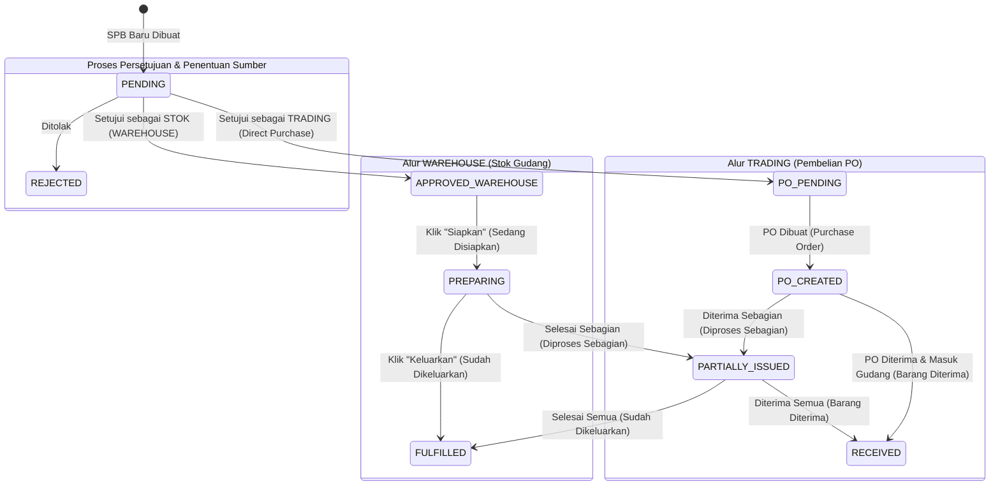

# Dokumentasi Integrasi & Monitoring Status SPB (Surat Permintaan Barang)

Dokumentasi ini dibuat untuk mempermudah **Sistem A** (sistem eksternal) dalam memantau dan memonitoring alur status barang (SPB dan SPB Items), mulai dari persetujuan awal, penentuan sumber barang (*Stok* vs *Trading*), proses persiapan barang di gudang (*preparing*), hingga barang dikeluarkan (*fulfilled*).

---

## 1. Diagram Alur Status SPB Item
Berikut adalah diagram transisi status barang (`SPBItem`) dari saat pertama kali dibuat hingga selesai diproses:



---

## 2. Struktur Database Relasional (Prisma)
Sistem A dapat memonitor status ini secara langsung dengan membaca database PostgreSQL pada tabel `spb` dan `spb_items`.

### Tabel `spb` (`@@map("spb")`)
Menyimpan informasi header transaksi Surat Permintaan Barang (SPB).

| Nama Kolom | Tipe Data | Deskripsi |
| :--- | :--- | :--- |
| `id` | UUID (PK) | ID unik SPB. |
| `spbNumber` | VARCHAR (Unique) | Nomor SPB (Contoh: `SPB-20260605-1829`). |
| `projectId` | UUID | Relasi ke ID Projek (`Project`). |
| `date` | TIMESTAMP | Tanggal pembuatan SPB. |

### Tabel `spb_items` (`@@map("spb_items")`)
Menyimpan baris item/barang yang diminta di dalam SPB beserta sumber dan statusnya.

| Nama Kolom | Tipe Data | Deskripsi |
| :--- | :--- | :--- |
| `id` | UUID (PK) | ID unik baris barang. |
| `spbId` | UUID | Relasi ke ID SPB (`SPB`). |
| `name` | VARCHAR | Nama barang. |
| `qty` | DOUBLE PRECISION | Jumlah unit yang diminta. |
| `unit` | VARCHAR | Satuan unit (Default: `pcs`). |
| `source` | VARCHAR | Sumber barang: `WAREHOUSE` (Stok) atau `TRADING` (Trading). |
| `status` | VARCHAR | Status barang saat ini di sistem. |

---

## 3. Kamus Status (Status Code Reference)

Untuk memantau status secara tepat, gunakan panduan nilai kolom `source` dan `status` pada tabel `spb_items` berikut:

### A. Alur Umum & Persetujuan
* **`status = 'PENDING'`**
  * **Deskripsi**: SPB baru masuk dan sedang menunggu persetujuan / verifikasi dari admin/purchasing.
* **`status = 'REJECTED'`**
  * **Deskripsi**: Permintaan barang ditolak oleh pihak berwenang.
* **`status = 'PARTIALLY_ISSUED'`**
  * **Deskripsi**: Barang baru selesai diproses sebagian (berlaku untuk alur `WAREHOUSE` maupun `TRADING`). Di-mapping sebagai **Diproses Sebagian**.

### B. Alur Barang menggunakan Stok (`source = 'WAREHOUSE'`)
* **`status = 'APPROVED_WAREHOUSE'`**
  * **Deskripsi**: Barang disetujui untuk diambil dari stok gudang, namun **belum mulai disiapkan** oleh tim inventory.
* **`status = 'PREPARING'`**
  * **Deskripsi**: Barang **sedang disiapkan** (*preparing*) di gudang oleh petugas logistik.
* **`status = 'FULFILLED'`**
  * **Deskripsi**: Barang **sudah dikeluarkan** (*fulfilled/issued*) dari gudang untuk dikirim ke lokasi projek.

### C. Alur Barang menggunakan Pembelian/Trading (`source = 'TRADING'`)
* **`status = 'PO_PENDING'`**
  * **Deskripsi**: Barang disetujui untuk dibeli ke supplier luar. Menunggu pembuatan Purchase Order (PO).
* **`status = 'PO_CREATED'`**
  * **Deskripsi**: Purchase Order sudah dibuat ke supplier, sedang menunggu pengiriman barang oleh supplier.
* **`status = 'RECEIVED'`**
  * **Deskripsi**: Barang belanjaan trading sudah diterima di gudang/lokasi projek.

---

## 4. Contoh Query SQL untuk Monitoring (Sistem A)

Sistem A dapat menggunakan query SQL berikut untuk memonitor status real-time dari database:

### A. Mendapatkan Status Seluruh Barang dari Nomor SPB Tertentu
```sql
SELECT 
  s."spbNumber",
  si.name AS "nama_barang",
  si.qty AS "quantity",
  si.unit AS "satuan",
  si.source AS "tipe_sumber",
  si.status AS "status_raw",
  CASE
    WHEN si.status = 'PENDING' THEN 'Menunggu Persetujuan'
    WHEN si.status = 'REJECTED' THEN 'Ditolak'
    WHEN si.status = 'PARTIALLY_ISSUED' THEN 'Diproses Sebagian'
    WHEN si.source = 'WAREHOUSE' AND si.status = 'APPROVED_WAREHOUSE' THEN 'Stok Disetujui (Belum Disiapkan)'
    WHEN si.source = 'WAREHOUSE' AND si.status = 'PREPARING' THEN 'Stok Sedang Disiapkan'
    WHEN si.source = 'WAREHOUSE' AND si.status = 'FULFILLED' THEN 'Stok Sudah Dikeluarkan'
    WHEN si.source = 'TRADING' AND si.status = 'PO_PENDING' THEN 'Trading Menunggu PO'
    WHEN si.source = 'TRADING' AND si.status = 'PO_CREATED' THEN 'Trading PO Sudah Dibuat'
    WHEN si.source = 'TRADING' AND si.status = 'RECEIVED' THEN 'Trading Barang Diterima'
    ELSE 'Status Tidak Terdefinisi'
  END AS "status_monitoring"
FROM spb_items si
JOIN spb s ON si."spbId" = s.id
WHERE s."spbNumber" = 'SPB-20260605-1829';
```

### B. Memeriksa Barang Stok yang Belum Selesai Dikeluarkan (Untuk Alert Gudang)
```sql
SELECT 
  s."spbNumber",
  si.name,
  si.qty,
  si.status -- 'APPROVED_WAREHOUSE' (Belum disiapkan), 'PREPARING' (Sedang disiapkan), atau 'PARTIALLY_ISSUED' (Diproses sebagian)
FROM spb_items si
JOIN spb s ON si."spbId" = s.id
WHERE si.source = 'WAREHOUSE' 
  AND si.status IN ('APPROVED_WAREHOUSE', 'PREPARING', 'PARTIALLY_ISSUED');
```

### C. Cek Persentase Kesiapan Pengeluaran Stok SPB
```sql
SELECT 
  s."spbNumber",
  COUNT(si.id) AS "total_barang_stok",
  SUM(CASE WHEN si.status = 'FULFILLED' THEN 1 ELSE 0 END) AS "sudah_dikeluarkan",
  ROUND((SUM(CASE WHEN si.status = 'FULFILLED' THEN 1 ELSE 0 END)::numeric / COUNT(si.id)::numeric) * 100, 2) AS "persen_kesiapan"
FROM spb_items si
JOIN spb s ON si."spbId" = s.id
WHERE si.source = 'WAREHOUSE'
GROUP BY s."spbNumber";
```

---

## 5. Monitoring via API Endpoint

Jika Sistem A tidak memiliki akses langsung ke database, Sistem A dapat melakukan request HTTP GET ke endpoint API internal:

### GET `/api/spb`
Mendapatkan daftar SPB beserta status item di dalamnya.

* **Query Parameters (Optional)**:
  * `source`: `WAREHOUSE` atau `TRADING` (untuk memfilter jenis pengadaan).
  * `status`: Status item tertentu (misal: `status=PREPARING`).
* **Contoh Response JSON**:
  ```json
  {
    "spbList": [
      {
        "id": "e67b2d56-78ab-4bcd-ef01-23456789abcd",
        "spbNumber": "SPB-20260605-4912",
        "date": "2026-06-05T03:30:00.000Z",
        "project": {
          "id": "a1b2c3d4-e5f6-7a8b-9c0d-e1f2a3b4c5d6",
          "projectName": "Projek Pembangunan Jembatan JLU",
          "customer": {
            "name": "PT. Pembangunan Jaya"
          }
        },
        "items": [
          {
            "id": "f89c0d1e-2a3b-4c5d-6e7f-8a9b0c1d2e3f",
            "name": "Besi Beton 12mm",
            "qty": 50,
            "unit": "batang",
            "source": "WAREHOUSE",
            "status": "PREPARING" // Sedang disiapkan di gudang
          },
          {
            "id": "c78d9e0f-1a2b-3c4d-5e6f-7a8b9c0d1e2f",
            "name": "Semen Tiga Roda",
            "qty": 100,
            "unit": "sak",
            "source": "WAREHOUSE",
            "status": "FULFILLED" // Sudah dikeluarkan dari gudang
          }
        ]
      }
    ]
  }
  ```
